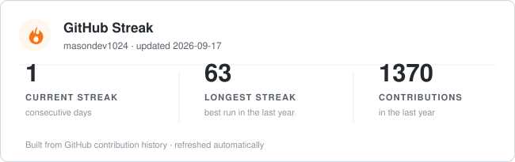

## Hi, I'm Mason

DevOps engineer with data-platform roots, building safe delivery systems and reliable event-data workloads.

Former BI Platform Engineer with 2 years and 5 months of enterprise platform operations experience. I approach reliability as a product concern: a release is not successful merely because an API returns `200`; it must also preserve the correctness, freshness, and recoverability of the data behind it.

## What I Build

- **Release reliability** — GitHub Actions OIDC, Terraform, EKS, Argo CD, Argo Rollouts, canary analysis, Prometheus/Grafana, k6, failure drills, and runbooks.
- **Event and data integrity** — Kafka/Kinesis ingestion, versioned contracts, DLQ isolation, idempotent consumers, lineage, Parquet/S3, and queryable validation.
- **Cost-aware operations** — short-lived AWS validation environments, explicit approval gates, teardown audits, and evidence that distinguishes local tests from cloud E2E results.

## Featured Work

| Project | Reliability problem addressed | Evidence |
| --- | --- | --- |
| [AWS Data Platform GitOps](https://github.com/masondev1024/aws-data-platform-gitops) | Safe GitOps delivery for a high-contention application | Immutable SHA images, GitHub Actions OIDC, Argo CD/Rollouts canary analysis, k6, RDS failover, rollback and capacity runbooks |
| [Kafka Streaming Data Platform](https://github.com/masondev1024/KafKa) | Event loss, duplicates, and invalid payloads in a streaming pipeline | Versioned contract, DLQ, explicit offset commit, `event_id` idempotency, Prometheus, Firehose to S3/Athena validation |
| [Robot Data Platform](https://github.com/masondev1024/robot-data-pipeline) | Operable AWS streaming and lakehouse workloads without permanent infrastructure spend | Kinesis/Firehose/S3, EKS, Terraform, SLO guardrails, short-lived E2E evidence, teardown audits |
| [ASK Seoul Agent](https://github.com/masondev1024/ask-seoul-agent) | Fail-closed AI/data service behavior when evidence is missing | Versioned API contract, allowlisted tools, deterministic evaluation gate, structured observability |

## Core Stack

## GitHub Activity

  

  

## Contact

[Velog](https://velog.io/@mason_dev) · [Email](mailto:masondev1024@gmail.com)
